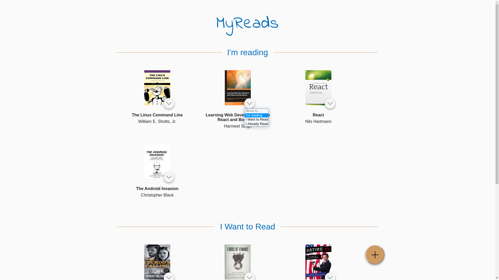
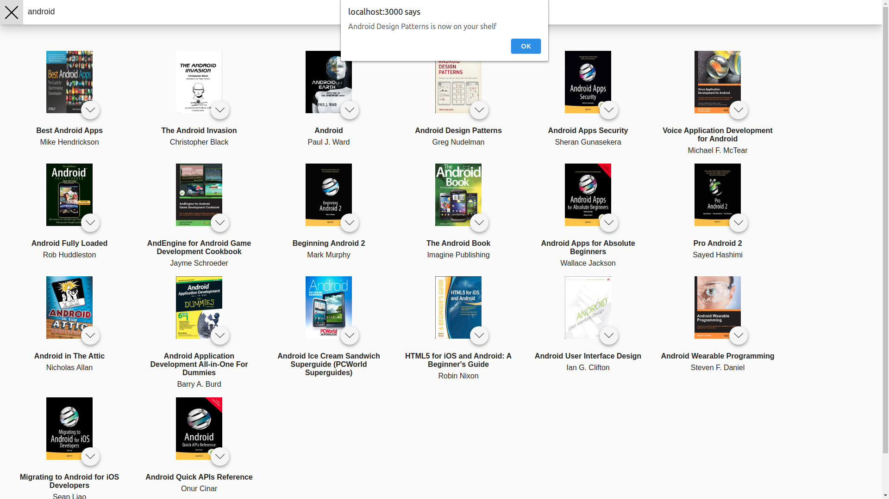

# Book Tracking App

Book tracking app is a project of Udacity React Nanodegree. While I was doing this project I made some changes to make it more modern visually, changed the way some features were done and the structure of the project.

If you want to see more projects, you can find me on [Linkedin](https://linkedin.com/in/mateus-alcantara-2b102218a) or [Medium](https://medium.com/@mateuscastro.al)

# Visuals



---



# Built with

- React JS
- Styled Components

## Installation

First you need to clone this git repository

```bash
git clone https://github.com/mat-alcantara/book-tracking-app.git
```

Then you go to the project's folder

```bash
cd book-tracking-app
```

and run

```bash
npm start
```
